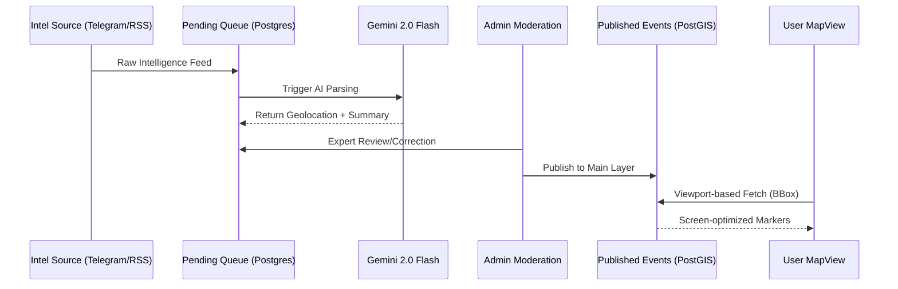

# OSINT Map System Architecture

This document explains the core technical architecture of the OSINT Map project.

> [!TIP]
> This architecture is designed for **sovereign hosting**. No external geospatial APIs (like Mapbox or Google Maps) are used for data storage or retrieval, ensuring maximum data privacy and cost control.

## 🏗️ 1. Geospatial Intelligence (GIS) Layer
Unlike typical map applications that handle coordinates as simple numbers, this system uses a professional-grade **GIS (Geospatial Information System)** approach.

- **Storage**: We use **PostgreSQL** with the **PostGIS** extension.
- **Data Type**: Locations are stored as `geometry(Point, 4326)`. This allows the database to understand the Earth's curvature (WGS84) and perform advanced spatial calculations.
- **Efficiency**: We use **R-Tree Indexing** to fetch markers only within the user's current viewport.

## 🔄 2. Data Flow: Spatial & Temporal Filtering
The map uses a **dual-filter** retrieval strategy:
1. **Spatial**: The `MapView` component tracks the BBox as the user pans/zooms.
2. **Temporal**: Users can filter messages by preset ranges (1H, 6H, 24H, 7D, 30D) or **custom start/end dates** (e.g., historical conflict periods).

The `/api/events` endpoint combines PostGIS `ST_Intersects` with standard SQL timestamp filtering for ultra-fast viewport-based range queries.

## 🛠️ 3. Strategic Intelligence Hub
The Moderation Hub at `/admin/queue` is a full CRUD (Create, Read, Update, Delete) engine:
- **Registry Tabs**: Separate views for `Pending Signals` (AI suggestions) and `Published Events` (Live map entries).
- **Edit on Map**: Admins can re-geolocate any signal by clicking the integrated map during review.
- **Source Verification**: All reports include automated **Telegram source links** and persistent media URLs (Vercel Blob Storage).
- **Multi-AI Engine**: Real-time switching between **Gemini 2.0 Flash** and **GPT-4o** parsing.

## 🔐 4. Access Control
- **RBAC**: Role-Based Access Control is enforced via **Better-Auth**.
- **Roles**: 
  - `user`: Can view the map and feed.
  - `analyst`: Can view systemic logs and pending queues.
  - `moderator`: Can edit and authorize pending signals.
  - `admin/owner`: Complete system control (purge, unpublish, role administration).

## 🗺️ 5. Sovereign Tile Hosting
The project is built for independence and cost-efficiency:
- **Tiles**: Served via `OpenFreeMap` (Bright style).
- **Engine**: `MapLibre GL` (Open-source alternative to Mapbox).
- **No Dependencies**: No paid proprietary APIs (Mapbox/Google) are required for core functionality.
